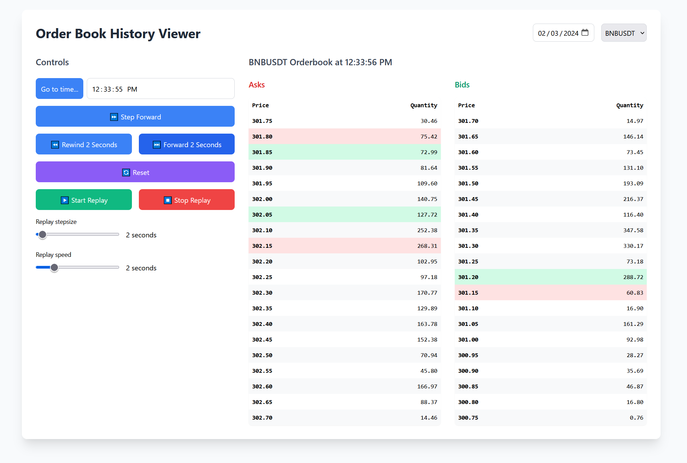

# Orderbook Replayer

A small fullstack app: a Python backend maintaining state of an archive closed limit order book (CLOB), and a Vue.js frontend visualizing said state, and providing controls for replay.


## Screenshots




## Orderbooks

The app works on historical orderbook data. Bybit (a major cryptocurrency exchange) provides 500-depth orderbook history for free download. The problem with this is size: a typical day of BTCUSDT trading is well over a gigabyte in the format they provide. So the backend includes a utility class (OrderBookProcessor) that takes such a Bybit history file as input, and outputs a new file with configurable depth. For an example, the repo includes a 20-depth book for February 3, 2024 for BNBUSDT. 20 levels are enough for most practical purposes and they require 3-10x less space than a full, depth-500 one.

## More technical details on orderbooks

Bybit's files includes a snapshot at start, i.e. all the 500 price levels and quantities for both the Bid and the Ask side. After this snapshot, a set of deltas are provided: they represent changed quantities for a given price level: 0 means no more offers on that price. 

Translating a depth 500 file to a depth 20 one means the deltas have to be processed, and for each set of deltas (1 set is all the changes carrying the same timestamp) internal state is updated, and a - potentially different - set of deltas is computed. For example deltas more than 20 levels beneath best price need not be propagated at this point: but it may become necessary to include them later if they enter top-20 (if no other delta for its price level appears in the meantime).

Some (most) deltas never become relevant, so will never make it to the output file - that's how space can be saved. 

The internal orderbook implementation uses sorted lists of tuples and the [bisect](https://docs.python.org/3/library/bisect.html) module for quick (O(log n)) lookups essential for processing performance: enabling conversion speed of around 10K delta-sets per second on big pairs (like BTCUSDT) for a 500->20 conversion.


## How can I create my own orderbook files?

Goto [Bybit's historical data download page](https://www.bybit.com/derivatives/en/history-data), download the orderbook(s) you need, then extract them. Do not modify the filename. Run orderbook processor (/src/backend/orderbook_processor.py) like this:


```bash
python -m orderbook_processor --file <bybit orderbook filename> [--depth <desired depth>]
```

The output file will be created in the same directory, and the same filename-structure will be maintained: the "ob500" part will be modified only to reflect the output depth.

## Run Locally

Clone the project:

```bash
  git clone https://github.com/dzakarias/orderbook-replayer.git
```

Go to the project directory:

```bash
  cd orderbook-replayer
```

The backend targets Python 3.11 and uses Poetry for dependencies. When you have these installed, you install dependencies with:

```bash
poetry install
```

Start the backend:

```bash
poetry run uvicorn src.backend.ob_replayer_backend:app --host 0.0.0.0 --port 8000 --reload
```


## Deploy online

The project includes a Dockerfile you can use to deploy it in a containerized manner. Here's it deployed to Render: https://orderbook-replayer.onrender.com/
It might take a minute to load as it's on a free account: so uses a Spot instance on AWS which take some time to fire up.

## Usage

When the app loads, select a date. A list of markets for which orderbook histories are available at the backend will be populated. Choose one to load the initial snapshot of that orderbook.
The repo includes only one orderbook file, so you'll need to select 02-03-2024 as date, and the BNBUSDT book history will be loaded.


## License

[MIT](https://choosealicense.com/licenses/mit/)


## Author

[@dzakarias](https://www.github.com/dzakarias) David Zakarias. Contact me at [LinkedIn](https://www.linkedin.com/in/david-zakarias-9720a24/) or email me at david (dot) zakarias (at) gmail (dot) com.

